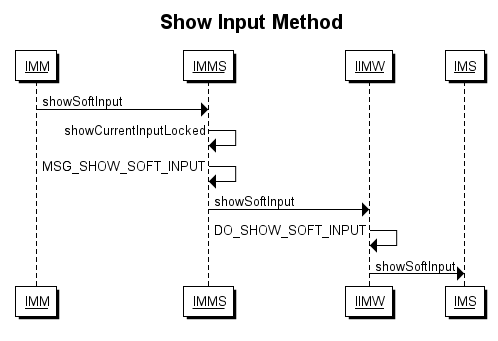

# Android输入法框架介绍

## 输入法的启动过程

输入法的启动不是在用户点击可编辑的View显示出入法的过程中完成的。而是从WmS切换到新的窗口开始的。当用户启动一个新的Activity时，或者退出当前Activity，或者关闭一个系统窗口。此时，Wms会通知客户端发生了焦点改变`WindowFocusChanged()`，客户端获得此消息后就开始了输入法的启动。当ViewRootImpl收到windowFocusedChanged的通知后，主要做了以下几件事：

1. 调用InputMethodManager的startGettingWindowFocus(mView)将该窗口对应的DecorView对象给到IMM。
2. 通知窗口中的每一个子View焦点发生变化。除了EditText在非Touch模式或者Touch模式下都可以获得焦点外，其他的组件在Touch模式下无法获得焦点。如果可以获得焦点那么最终会调用到IMM的checkFocus()方法。
3. 判断该窗口是否需要输入法。如果一个窗口中没有可以被编辑的View，那么该该窗口就是不可输入的，这里会调用WindowManager.LayoutParams.mayUseInputMethod判断。如果是可输入的，最终也会调用到checkFocus()方法。在checkFocus()方法中会判断mServedView和mNextServedView是否相等，默认第一次调用mServedView为Null，而mNextServedView则是窗口中第一个可以获得焦点的View。两者不相等则会调用startInputInner()方法并开始启动输入法。

在startInputInner()方法中会将mClient、ControlledInputConnectionWrapper等作为参数传给InputMethodManagerService的startInput方法。其中mClient是IMM内部类，其实现了IInputMethodClient接口并且是一个binder；ControlledInputConnectionWrapper封装了可编辑View的InputConnection接口实现，当前线程的Looper，和IMM本身。

进入IMMS的startInput()方法后，会调用到startInputUncheckedLocked()方法，在这里会判断当前窗口是否已经改变，如果改变就需要解除对原有窗口的绑定。判断输入法Service是否已经启动，没有启动就会调用startInputInnerLocked()启动输入法Service。

> NOTE:会判断系统默认输入是否已经改变（mCurId和mCurMethodId是否相等），再判断输入法Servic是否启动（mHaveConnection是否为True，mCurMethod是否为空）。

在使用startInputInnerLocked()之后，IMMS主要做了三件事来启动InputMethodService。

1. 调用bindServiceAsUser()启动InputMethodService
2. 在onServiceConnection回调中，调用IMS的attachTocken()将当前窗口在WmS中对应的tocken告知IMS。调用IMS的createSession()方法创建一个Sesstion Binder，随后IMMS会把这个Binder传递给输入窗口的IMM中，以便输入窗口可以直接和IMS通信。
3. 调用attachNewInputLocked()方法，将输入窗口中可编辑View的InputConnection Binder传递给IMS，将IMS的InputMethodSession Binder传递给输入窗口的IMM。至此IMS的启动完成，下面进行输入法的显示

下图是IMS的启动过程，其中IMMS（InputMethodManagerService）、IMS（InputMethodService）、ASIMS（AbstractInputMethodService）、IMI（InputMethodImpl）、IIMW（IInputMethodWrapper）、IMM（InputMethodManager）。

## 输入法的显示

当需要显示输入法窗口进行输入时，会调用到IMM的showSoftInput()方法，随后会调用到IMMS的同名方法。在IMMS中通过异步机制发出一个MSG_SHOW_SOFT_INPUT的消息，消息被处理执行IMW的同名函数showSoftInput()随后又转到IMS的同名方法showSoftInput()进入IMS的窗口创建和显示过程。

下图是显示输入法的时序图：

进入IMS的showSoftInput()方法后的流程图

# 参考

* [Creating an Input Method](https://developer.android.com/guide/topics/text/creating-input-method.html)
* [On-screen Input Methods](http://android-developers.blogspot.com/2009/04/updating-applications-for-on-screen.html)
* [SoftKeyboard](https://android.googlesource.com/platform/development/+/master/samples/SoftKeyboard/)
* [Android内核剖析](#inner)
