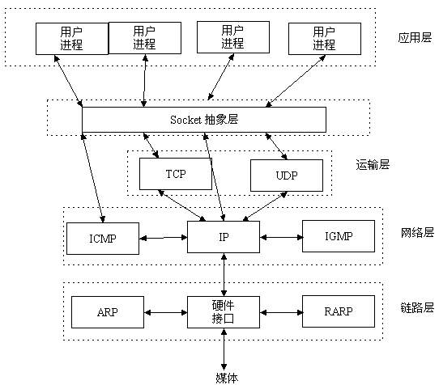
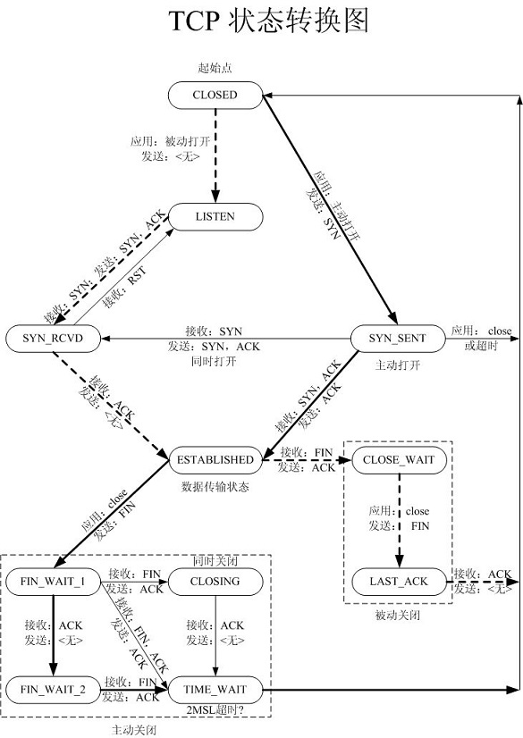
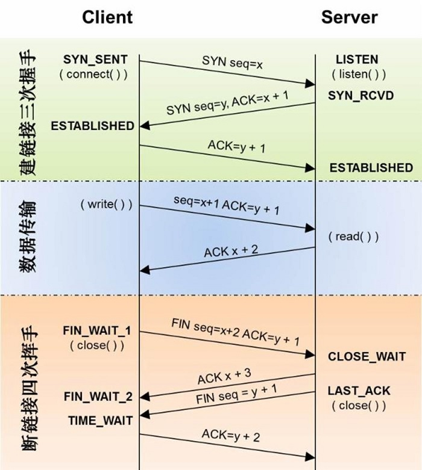
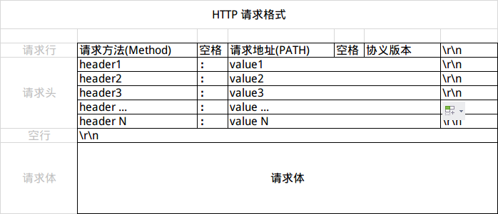
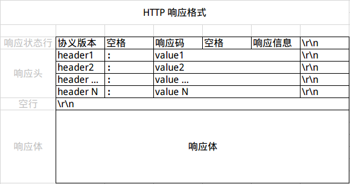
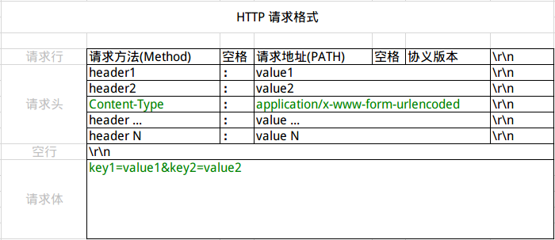

# Android 网络操作

在移动互联网时代，基本所有的的Android应用都已联网为充分必要条件，所有Android应用的网络开发也成为必须技能。

## 基本概念

在网络开发过程中最经常接触到的概念就是TCP/IP协议，SOCKET套接字，HTTP协议。

### 1. TCP/IP

TCP/IP是一个协议族,它包含了很多协议，和它相对应的是OSI（Open System Interconnect）网络七层模型。

|OSI分层|功能|TCP/IP协议|
|:--------:|:--------:|:--------:|
|应用层(Application Layer)|文件传输，电子邮件，文件服务，虚拟终端|HTTP,SNMP,FTP,SMTP,Telnet,TFTP|
|表示层(Presentation Layer)|数据格式化，代码转换，数据加密|没有协议|
|会话层(Session Layer)|解除或建立与其他接点的联系|没有协议|
|传输层(Transport Layer)|提供端对端的接口|TCP,UDP|
|网络层(Network Layer)|为数据包选择路由(地址解析和路由)|IP,ICMP,RIP,OSPF,BGP,IGMP|
|数据链路层(Data Link Layer)|数据成帧，错误检测，流量控制|SLIP,CSLIP,PPP,ARP,RARP,MTU|
|物理层(Physical Layer)|二进制数据形式在物理媒体上传输数据|IOS2110,IEEE802，IEEE802.2|


除了OSI划分的七层模型，在更早的时候是TCP/IP的五层模型，其中TCP/IP五层模型中的应用层对应OSI七层模型的应用层+表示层+回话层，其余相同。

### 2. Socket

Socket，一个应用程序接口，使主机或一台计算机上的进程间可以通讯。（[摘自维基百科](https://zh.wikipedia.org/wiki/Berkeley%E5%A5%97%E6%8E%A5%E5%AD%97)）因此Socket是把TCP/IP层复杂的操作抽象为简单的接口供应用层调用来实现网络通讯。



在Socket中封装的主要是使用TCP协议的流套接字和使用UDP协议的数据报套接字。

`TCP`(Transmission Control Protocol,传输控制协议)是面向连接的协议，也就是说。在收发数据前，必须和对方建立可靠的连接。TCP协议建立连接需要**三次握手**，在三次握手的过程中主要通过判断位码来建立连接，总共有六种位码：SYN(Synchronous 建立连接)，ACK(Acknowledgement 确认)，FSH(Push 传送)，FIN(Finish 结束)，RST(Reset 重置)，URG(Urgent 紧急)。Sequence Number(顺序码)，Acknowledge Number(确认号)。

1. 客户端发送SYN包，其中SYN=1，Sequence Number=x(x为随机生成)，进入SYN_SENT状态
2. 服务器收到SYN包，发送SYN+ACK包到客户端，其中SYN=1，ACK=1，Sequence Numer=y(y为服务器随机生成)，Acknowledge Numer=x+1(x为主动发SYN包中携带的顺序码)，进入SYN_RECV状态
3. 客户端收到SYN+ACK包，发送ACK包到服务器，其中ACK=1，Acknowledge Number=y+1(y为服务器发送SYN+ACK包中携带的顺序码)，至此发送完毕，到服务器接收到数据包，双方进入ESTABLISHED状态，建立连接完成。

当通讯双发完成数据传输后，就可以断开连接。由于TCP连接时全双工的，因此每个方向都必须单独进行关闭。TCP断开连接需要经历**四次握手**过程。

1. 客户端发送FIN+ACK包，其中FIN=1，ACK=1，Sequence Number=x，Acknowledge Number=y，客户端进入FIN_WAIT_1状态并关闭客户端到服务器的连接
2. 服务器收到FIN+ACK包，发送ACK包到客户端，其中ACK=1，Acknowledge Number=x+1(x为客户端中发送的顺序码)，客户端收到ACK包后进入FIN_WAIT_2状态
3. 服务器关闭与客户端的连接，发送FIN包到客户端，其中FIN=1，Sequence Number=y+1。服务器进入LAST_ACK状态。
4. 客户端收到FIN包，进入TIME_WAIT状态，并发ACK包到服务器，其中ACK=1，Acknowledge Number=y+2，至此双方完成四次握手断开连接。





`UDP`(User Datagram Protocol 用户数据报协议)，是一种面向非连接的协议，面向非连接指的是在正式通讯前不必与对方先建立连接，不管对方状态就直接发送。至于对方是否可以接到通信数据内容，UDP协议无法控制，因此说UDP协议是一种不可靠的协议。UDP协议只适合一次性传输少量数据，对可靠性要求不高的应用环境。

### 3. HTTP/HTTPS

#### 3.1 HTTP协议

`HTTP`(HyperText Transfer Protocol, 超文本传输协议)，HTTP是一个客户端（用户）和服务器（网站）请求和应答的标准。通过使用Web浏览器、网络爬虫或者其他的工具，客户端发起一个HTTP请求到服务器上指定的端口（默认端口为80）。我们称这个客户端为用户代理程序（user agent）。应答服务器上存储着一些资源，比如HTML文件和图像，我们称这个应答服务器为源服务器（origin server）。

#### 3.2 HTTPS协议

`HTTPS`(HyperText Transfer Protocol Over Secure Socket Layer)，以安全为目的的HTTP通道。HTTPS的安全基础是`SST/TSL`，`SSL`(Secure Sockets Layer, 安全套接层)是网景公司开发为了解决`HTTP`协议明文传输会造成内容被嗅探和篡改问题的加密协议，后来由于`SSL`的应用广泛，IETF就把`SSL`协议标准化，标准化之后改名为`TLS`(Transport Layer Security, 传输层安全协议)，因此两者可以视为同一个东西的不同阶段。

#### 3.3 URL

`URL`(Uniform Resouce Locator)统一资源定位器，它是指向互联网资源的指针。资源可以是简单的文件后者目录，也可以是更为复杂的对象的引用，例如对数据库或者搜索引擎的查询。其格式如下：

```url
schema://host[:port#]/path/../[?query-string][#anchor]
```

* `schema`：指定底层使用的协议，例如http，https，ftp
* `host`：http服务器的IP地址或者域名
* `port#`：http服务器的默认端口是80，这种情况下可以省略。如果使用了逼的端口必须指明，例如`http://127.0.0.1:8085`
* `path`：访问资源的路径
* `query-string`：发送给http服务器的数据
* `anchor`： 锚

#### 3.4 Http请求报文格式

HTTP的请求报文分为三部分：请求行、请求头、请求体



##### 请求行

请求行（Request Line）分为三部分：请求方法（Method）、请求地址（Request-URI）、协议及版本（HTTP-Version）。`HTTP/1.1`定义了8种请求方法：`GET`、`POST`、`PUT`、`DELETE`、`PATCH`、`HEAD`、`OPTIONS`、`TRACE`。最常用的是`GET`和`POST`。

请求资源即URI（Uniform Resouce Identifiers, 统一资源标识符）地址。

Http协议有如下版本：HTTP/0.9、HTTP/1.0、HTTP/1.1、HTTP/2.0，其中现在被广泛使用的是HTTP/1.1协议版本。

#### 3.5 Http响应报文格式

HTTP响应的格式出了状态行与请求的请求行不一样，其他就格式而言是一样的。但同过请求头和响应头的不用还是可以判断出请求报文还是响应报文。



响应状态行（Response Line）分为三部分：协议版本（HTTP-Version）、响应码（Status Code）、响应信息（Reason Phrase）。

响应码也叫状态码，有三位数字组成，第一个数字定义了响应的级别，有五种可能：

* 1XX：指示消息，表示请求已接收，继续处理
* 2XX：成功，表示请求已被成功接收、理解、处理
* 3XX：重定向，表示要完成请求必须进行进一步的操作
* 4XX：客户端错误，请求有语法错误或请求无法实现
* 5XX：服务端错误，服务器未能实现合法请求

[状态码详解](http://tool.oschina.net/commons?type=5)

响应信息即是对状态码的描述

#### 3.6 Header

Header可以分为请求头和响应头，它们的格式都是键值对存在。

##### 3.6.1 请求和响应通过的Header

|名称|作用|
|:--------:|:----------:|
|Content-Type|请求体或响应体的类型，如：text/plain、application/json|
|Accept|说明接收的类型，可以有多个值，用`,`隔开|
|Content-Length|请求体或响应体的长度，单位字节|
|Content-Encoding|请求体或响应体的编码格式，如gzip、deflate|
|Accept-Encoding|告知对方我放接受的Content-Encoding|
|ETag|给当前资源的标示，和`Last-Modified`、`If-None-Match`、`If-Modified-Since`配合，用于缓存控制|
|Cache-Control|取值一般为`no-cache`或`max-age=XX`，XX为整数，标示改资源存在有效期（秒）|

##### 3.6.2 请求常见Header

|名称|作用|
|:--------:|:----------:|
|Authorization|用于设置身份认证信息|
|User-Agent|用户标示，如：OS和浏览器的类型和版本|
|If-Modified-Since|值为上一次服务器返回的`Last-Modified`值，用于确认某个资源是否被改过，没有更改过（304）就从缓存中读取|
|If-None-Match|值为服务器上一次返回的`ETag`值，一般会和`If-Modified-Since`一起出现|
|Cookie|已有的Cookie|
|Referer|表示请求引用自哪个地址|
|Host|请求的主机和端口号|

##### 3.6.3

|名称|作用|
|:--------:|:----------:|
|Date|服务器的日期|
|Last-Modified|该资源最后被修改的时间|
|Transter-Encoding|取值一般为`chunked`，出现在`Content-Length`不能确定的情况下，表示服务器不知道响应版体的数据大小，一般还会出现`Content-Encoding`响应头|
|Set-Cookie|设置Cookie|
|Location|重定向到另一个URL|
|Server|后台服务器|

#### 3.7 请求体

##### 3.7.1 Get方法

使用`GET`方法没有请求体，请求参数和对应的值附加在URL后面，利用一个`?`代表URL结尾和请求参数的开始，多个参数之间用`&`隔开，参数与对应值之间用`=`隔开。

```url
http://www.google.cn/search?hl=zh-CN&source=hp
```

###### 3.7.2 Post方法

`POST`方法将提交的数据以键值对的形式放在请求体（Body）中，此时`Content-Type`为`application/x-www-form-urlencoded`。



## 系统API

### 1. Java Socket

#### 1.1 Java TCP

Java为TCP协议提供了两个类，Socket类和ServerSocket类。一个Socket实例代表了一个TCP连接的客户端，而一个ServerSocket实例代表了TCP连接的服务端。一般在TCP Socket编程中，客户端有多个，而服务端只有一个，客户端向服务端发送连接请求 ，服务端通过ServerSocket实例的accept方法接收一个客户端的连接请求，该方法将返回一个与客户端Socket对应的Socket，否则该方法将一直处于阻塞状态，线程也被阻塞。当客户端和服务端产生了对应的Socket之后，程序无需再区分服务端和客户端，而是通过各自的Socket进行通信。Socket提供了getInputStream和getOutputStream两个方法来获取输入流和输出流，我们通过将字节写入OutputStream来发送数据，并通过InputStream来接收数据。

#### 1.2 Java UDP

Java使用DatagramSocket代表UDP协议的Socket，DatagramSocket本身不维护状态，不产生IO流，它唯一的作用是通过send和receive方法来发送和接收数据，Java使用DatagramPacket来代表数据报，DatagramSocket接收和发送的数据都是通过DatagramPacket对象完成的。发送信息时，Java创建一个包含特定发送信息的DatagramPacket实例，并将其作为参数传递给DatagramSocket实例的send方法；接收信息时，Java程序首先创建一个DatagramPacket实例，该实例预先分配了空间，并将该DatagramPacket实例作为参数传递给DatagramSocket实例的receive方法中，当有消息到来时，接收的信息将存放在创建的DatagramPacket中。在创建DatagramPacket实例时，需要注意，如果该实例用来存在待接收的数据，则不指定数据来源的远程主机和端口，只需要指定一个缓存数据的byte数组即可，而如果该实例用来封装待发送的数据，则需要指定要发送的目的主机和端口。

### 2. HttpURLConnection

[HttpURLConnection](http://www.apihome.cn/api/java/HttpURLConnection.html)是JDK里提供的联网API，如果要使用HttpURLConnection联网，首先需要创建一个URL对象，并传入目标的网络地址，然后调用openConnection方法获取[URLConnection](http://www.apihome.cn/api/java/URLConnection.html)对象，它代表了一个与URL实例所引用的远程对象的连接，但此时还没有建立连接。

```java
URL url = new URL("http://gank.io/api/data/Android/1/1");
HttpURLConnection httpConnection = (HttpURLConnection) url.openConnection();
```

> NOTE：HttpURLConnection是URLConnection抽象类的子类。

在得到HttpURLConnection的实例后，就可以设置HTTP请求的参数。

```java
// 设置请求方法，默认GET方法
httpConnection.setRequestMethod("GET");

// 设置是否向HttpURLConnection输出，默认为false，如果需要OutputStream
// 向请求体写数据，需要设为true
httpConnection.setDoOutput(false);

// 是否从HttpURLConnection读入数据，默认为true，如果不要InputStream从响应
// 体读取数据，则可以设为false
httpConnection.setDoInput(true);

// 是否启动缓存
httpConnection.setUseCaches(true);

// 所有对Http请求的设置操作必须在connect方法之前完成
// 创建一个到URL引用资源的通信连接
httpConnection.connect();
```

设置好HTTP请求参数后，既可以通过`getInputStream`方法获取响应的状态码和数据。

```java
// 获取响应状态码，这里首先会调用getInputStream方法来发送HTTP请求到服务器，
// 如果此时连接未建立则会调用connect方法建立连接，因此可以不调用上述的connet方法
if(httpConnection.getResponseCode() == HttpURLConnection.HTTP_OK){

    StringBuilder strResponse = new StringBuilder();
    byte[] buffer = new byte[1024];
    InputStream in = httpConnection.getInputStream();
    while(in.read(buffer) != -1){
    	strResponse.append(new String(buffer));
    }
    System.out.println(strResponse);
}

// 请求结束后，断开连接
httpConnection.disconnect();
```

如果是通过POST方式发送HTTP请求需要注意如下：

* 需要设置`setDoOutput`为true，来向HTTP请求体写入数据
* 使用`setRequestProperty`设置`Content-Type`等请求头信息
* 调用`getOutputStream`来向请求体写入请求数据，在完成数据写入后需要调用`flush`和`close`方法刷新输出流并关闭输出流，此时会生成Http请求体

由于HTTP请求的的格式决定，在调用`getInputStream`方法发送请求后对HttpURLConnection对象进行设置（对http请求头的信息进行设置）或者写入`OutputStream`（对请求体写入信息）都是错误的，并且会导致异常发生。

HttpURLConnection是基于HTTP协议，但其底层是通过TCP Socket通信实现的，如果不设置超时，在网络异常的情况下，可能会导致程序僵死而不继续往下执行。可以通过`setConnectTimeout`和`setReadTimeout`设置连接超时和读超时。

前面的`URLConnection`和`HttpURLConnection`都是抽象类，真正的实现类是`sun.net.www.protocol.http`包下的[`HttpURLConnection`](http://grepcode.com/file/repository.grepcode.com/java/root/jdk/openjdk/8u40-b25/sun/net/www/protocol/http/HttpURLConnection.java#HttpURLConnection)

### 3. HttpClient

HttpClient是Apache提供的HTTP访问网络接口，从一开始的时候就被引入到AndroidAPI中，它可以完成和HttpURLConnection一样的效果，但使用方法有区别。

首先需要创建HttpClient对象，然后创建请求方法实例，如果是GET请求就创建HttpGet对象；如果是POST请求则需要创建HttpPost对象。

```java
// 创建HttpClient实例
CloseableHttpClient httpClient = HttpClients.createDefault();

// 创建HttpGet实例用于GET请求
HttpGet httpGet = new HttpGet("http://gank.io/api/data/Android/1/1");

// 执行GET请求，并返回HttpResponse对象
CloseableHttpResponse httpResponse = httpClient.execute(httpGet);
```

服务器返回的所有信息都封装在HttpResponse对象里。首先要获取服务器返回的状态码，如果等于200说明请求和响应都成功，就可以调用`getEntity`方法获取HttpEntity实例，HTTP响应的正文就包在这个对象里。

```java
// 获取响应状态码
if(httpResponse.getStatusLine().getStatusCode() == 200){

	HttpEntity entity = httpResponse.getEntity();
	// 打印响应内容
	System.out.println(EntityUtils.toString(entity));
}
```
如果是POST请求，不仅需要用HttpPost代替HttpGet，并且需要通过一个NameValuePair的集合来存放待提交的参数，然后将这个参数集传入一个UrlEncodedFormEntiry中，最后调用HttpPost的setEntiry方法将构建好的UrlEncodedFormEntiry传入，接下来操作和HttpGet一样，调用HttpClient的execute方法执行请求，通过HttpResponse获取响应。

```java
List<NameValuePair> params = new ArrayList<NameValuePair>();
// 设置请求参数
params.add(new BasicNameValuePair("username", "admin"));
params.add(new BasicNameValuePair("password", "123456"));
// 构建UrlEncodedFormEntity
UrlEncodedFormEntity entity = new UrlEncodedFormEntity(params, "utf-8");
// 将参数集合放入HttpPost请求中
httpPost.setEntity(entity);
```

这里推荐使用`CloseableHttpClient`代替`HttpClient`和使用`CloseableHttpResponse`代替 `httpResponse`，前两者均继承了`Closeable`接口，可以在使用后断开连接，释放资源。

```java
// 关闭响应连接
httpResponse.close();

// 关闭请求连接
httpClient.close();
```

HttpClient提供的API众多，以上只是简单使用，更多的可以参考官网提供的样例，·[HttpClient官网事例](http://hc.apache.org/httpcomponents-client-ga/examples.html#)

### 4. HttpURLConnection和HttpClient区别

在Froyo(2.2)之前，HttpURLConnection有一个重大的Bug，调用close()函数会影响连接池，导致连接复用失效，所以在Froyo之前使用HttpURLConnection需要关闭keepAlive。而HttpClient则问题较少。但在Gingerbread(2.3)HttpURLConnection默认开启了gzip压缩，提高了HTTPS的性能，而IceaCream Sandwich(4.0)的HttpURLConnection支持了请求缓存。再加上HttpURLConnection本身的API相对简单，所以在Android 2.3以后官网更推荐使用HttpURLConnection，之前推荐使用AndroidHttpClinet（HttpClient的封装）。

## 第三方网络库

### 1. OkHttp

### 2. Retrofit

# 参考

* [简单理解Socket](http://www.cnblogs.com/dolphinX/p/3460545.html)
* [OSI七层与TCP/IP五层网络架构详解](http://network.51cto.com/art/201310/413853.htm)
* [Android网络操作和优化相关](http://blog.csdn.net/sdkfjksf/article/details/51645315)
* [你应该知道的HTTP基础知识](http://www.jianshu.com/p/e544b7a76dac)
* [Android网络请求心路历程](http://www.jianshu.com/p/3141d4e46240)
* [TCP网络关闭的状态变换时序图](http://coolshell.cn/articles/1484.html)
* [HttpClient使用详解](http://blog.csdn.net/wangpeng047/article/details/19624529)
* [JDK中的URLConnection参数详解](http://www.blogjava.net/supercrsky/articles/247449.html)
