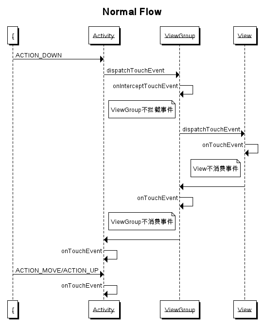
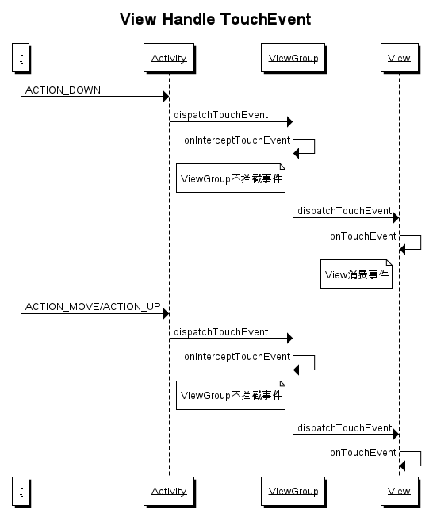
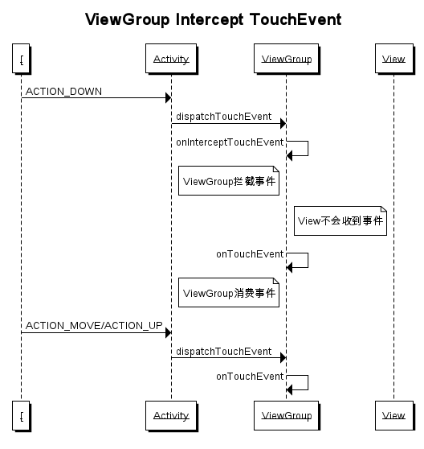

# Touch事件分发流程及处理

所谓的事件分发，其实就是对MotionEvent事件产生以后，系统需要把这个事件传递给一个具体的View，而这个传递过程就是分发过程。在这个分发过程中主要由三个重要的方法完成：`dispatchTouchEvent`（分发）、`onInterceptTouchEvent`（拦截）、`onTouchEvent`（消费）。

* `public boolean dispatchTouchEvent(MotionEvent ev)`

用来进行事件分发。如果事件能都传递给当前View，那么此方法一定会被调动，返回结果受当前View的`onTouchEvent`方法和下级View的`dispatchTouchEvent`方法的影响。

* `public boolean onInterceptTouchEvent(MotionEvent event)`

在方法dispatchTouchEvent中被调用，用来判断是否拦截某个事件，如果当前View拦截了某个事件，那么在同一个事件序列当中，此方法不会再被调用。返回结果表示是否拦截某个事件。

* `public boolean onTouchEvent(MotionEvent event)`

在dispatchTouchEvent中被调用，用来处理Touch事件，返回结果表示是消耗当前事件，如果不消耗，则在同一个事件序列中，当前view无法再次接收到事件。

> NOTE:同一事件序列，是指从手指解除屏幕开始到手指离开屏幕的那一刻，这个过程中产生的一些列事件，事件的类型可以分为ACTION_DOWN、ACTION_UP、ACTION_MOVE、ACTION_POINTER_DOWN、ACTION_POINTER_UP、ACTION_CANCEL。所有的事件序列都是从ACTION_DOWN开始到ACTION_UP结束。

**Touch事件的传递流程**

1. 所有的事件都是从Activity.dispatchTouchEvent()开始分发
2. 父View（ViewGroup）会把事件分发给它的子View，同时父View（ViewGroup）可以通过onInterceptTouchEvent()拦截事件（默认ViewGroup的onInterceptTouchEvent返回false）。
3. 如果事件从下往下传递的过程中没有被拦截，且最底层的View没有消费这个事件（onTouchEvent返回false），那么这个事件会反向网上传递，这个时候父View（VViewGroup）可以消费这个事件，如果还是没有被消费，那么最终这个事件会传递到Activity的onTouchEvent中（任何未被消费的事件都会最终传递到Activity的oonTouchEvent）。
4. 如果View设置了onTouchListener，那么其优先级高于onTouchEvent，且只有在onTouchListener不消费事件的情况下，onTouchEvent才会被调用。在onTouchEvent方法中，如果设置了onClickListener，那么它的onClick()方法会被调用，所有onTouchEvent的优先级高于onClickListener。
5. 某个父View（ViewGroup）一旦拦截某个事件，那么这个事件序列后续的事件都会由它来处理，并且它的onInterceptTouchEvent不会再被调用。
6. View的onClickListener被调用的前提是当前View是可点击的，并且其必须可以收到ACTION_DOWN和ACTION_UP事件。
7. 事件总是从父View（ViewGroup）传递给子View，而子View可以通过requestDisallowInterceptTouchEvent方法干扰父View（ViewGroup）的事件拦截（ACTION_DOWN事件除外）。

**正常的TouchEvent传递时序图**

**TouchEvent被底层View消费时序图**

**TouchEvent被父View（ViewGroup）拦截时序图**

# 参考

* [Android开发艺术探索](Touch事件分发流程.md)
* [Managing Touch Events in a ViewGroup](https://developer.android.com/training/gestures/viewgroup.html)
* [图解 Android 事件分发机制](http://www.jianshu.com/p/e99b5e8bd67b)
* [可能是讲解Android事件分发最好的文章](http://www.jianshu.com/p/2be492c1df96)
* [Android-三张图搞定Touch事件传递机制](http://hanhailong.com/2015/09/24/Android-%E4%B8%89%E5%BC%A0%E5%9B%BE%E6%90%9E%E5%AE%9ATouch%E4%BA%8B%E4%BB%B6%E4%BC%A0%E9%80%92%E6%9C%BA%E5%88%B6/)
