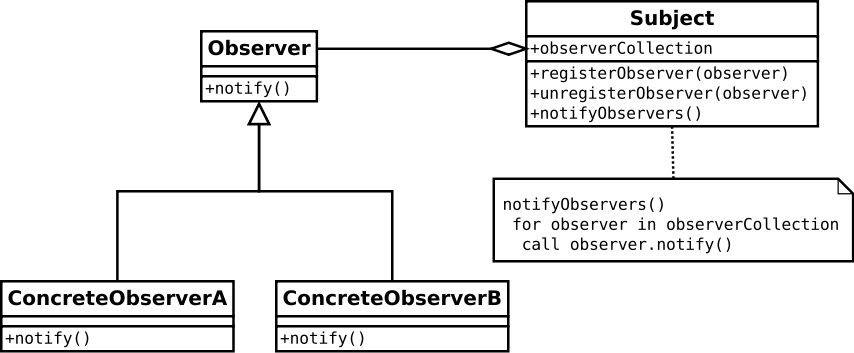

# 观察者模式与EventBus3

## 1. 观察者模式

### 1.1 观察者模式定义

定义对象间一种一对多的依赖关系，使得每当一个对象改变状态，则所有的依赖于它的对像都会得到通知并被自动更新

### 1.2 观察者模式的使用场景

* 关联行为场景
* 事件多级触发场景
* 跨系统的消息交换场景

### 1.3 观察者模式的UML



### 1.4 Android源码中的观察者模式

## 2.EventBus

### 2.1 EventBus简介

EventBus是一个开源的基于发布/订阅模式的用来解决对象间耦合问题的Android库。


### 2.2 EventBus特性

* 基于注解的，使用`@Subscribe`注解事件订阅函数。
* 订阅函数可异步，通过`ThreadMode`，可以设置订阅函数运行在Main线程还是异步后台线程
* 事件和订阅支持继承，发布子类的事件，则订阅了父类事件的函数也会接收到消息。
* 支持定制`EventBus`，通过`EventBusBuilder`可以定制`EventBus`

### 2.3 使用EventBus3

#### 2.3.1 定义事件

EventBus中的事件即是一个简单的Java对象
```java
public class MessageEvent {
    public String message;

    public MessageEvent(String message) {
        this.message = message;
    }
}
```

#### 2.3.2 准备订阅函数

如果事件被发布，那么事件订阅函数就会被调用。在EventBus3使用注解`@Subscribe`标注事件订阅函数，函数的命名可以自由进行，不再像EventBus2那也有严格的限制。

```java
// This method will be called when a MessageEvent is posted
@Subscribe
public void onMessageEvent(MessageEvent event){
    Toast.makeText(getActivity(), event.message, Toast.LENGTH_SHORT).show();
}
```

当定义好事件订阅函数后，需要将其注册到EventBus中，也只有事件订阅函数被注册，其才能接收到相应的事件。在Activity和Fragment中通常会根据他们的生命周期完成注册和取消注册。

```java
@Override
public void onStart() {
    super.onStart();
    EventBus.getDefault().register(this);
}

@Override
public void onStop() {
   EventBus.getDefault().unregister(this);
    super.onStop();
}
```

#### 2.3.3 发布事件

可以在代码中的任何位置发布事件，但同时也需要注意事件订阅函数和事件发布的运行线程。

```java
EventBus.getDefault().post(new MessageEvent("Hello world!"));
```

### 2.4 EventBus3的异步

EventBus3可以设置订阅函数的执行线程，通过在注解`@Subscribe`中设置`threadMode`。`ThreadMode`有四种选择，分别是`POSTING`、`MAIN`、`BACKGROUND`、`ASYNC`。

#### 2.4.1 ThreadMode.POSTING

`ThreadMode.POSTING`模式是默认的线程模式，其特点是事件订阅和事件发布在运行在同一个线程中。当事件被发布的同时，所有的事件订阅函数即被调用，其避免了线程切换的开销。因此，不应该在事件订阅函数中做耗时的操作，否则会阻塞发布事件的函数。

```java
@Subscribe(threadMode = ThreadMode.POSTING)
public void onHandleEvent(MessageEvent event){
        if(DEBUG) Log.i(TAG, "onHandleEvent");
        if(DEBUG) Log.i(TAG,"Current Thread:"+Thread.currentThread().getName());
        if(DEBUG) Log.i(TAG,"Message:"+event.getMessage());
    }
```

#### 2.4.2 ThreadMode.MAIN

`ThreadMode.MAIN`模式代表事件订阅函数将在Android的`main`线程（UI线程）中被调用。如果事件发布在`main`线程中，则事件订阅函数将被直接调用，此时与`ThreadMode.POSTING`没有区别，那么事件的处理也应该及时的完成返回，避免阻塞`main`线程造成`ANR`。

```java
@Subscribe(threadMode = ThreadMode.MAIN)
public void onHandleEventMain(MessageEvent event){
        if(DEBUG) Log.i(TAG, "onHandleEventMain");
        if(DEBUG) Log.i(TAG,"Current Thread:"+Thread.currentThread().getName());
        if(DEBUG) Log.i(TAG,"Message:"+event.getMessage());
        Toast.makeText(this,"onHandleEventMain:"+"Current Thead:"+Thread.currentThread().getName()+" Message:"+event.getMessage(),
            Toast.LENGTH_LONG).show();
    }
```

#### 2.4.3 ThreadMode.BACKGROUND

如果订阅函数使用`ThreadMode.BACKGROUND`，则其将被在后台线程中调用。这里的`background thread`主要区别于`main thread`，如果事件发布不在`main`线程中，则事件订阅函数将被调用在于事件发布同一个线程中。如果事件发布在`main`线程中，EventBus将创建**一个**单独的后台线程来处理所有的事件，因此如果有多个同一个事件的订阅函数采用此模式，应避免在订阅函数中做耗时的处理，造成后台线程阻塞，其他订阅函数无法被调用。

```java
@Subscribe(threadMode = ThreadMode.BACKGROUND)
public void onHandleEventBackground(MessageEvent event){
        if(DEBUG) Log.i(TAG, "onHandleEventBackground");
        if(DEBUG) Log.i(TAG,"Current Thread:"+Thread.currentThread().getName());
        if(DEBUG) Log.i(TAG,"Message:"+event.getMessage());
    }
```

#### 2.4.4 ThreadMode.ASYNC

当需要事件发布与事件订阅异步的时候，可以采用`ThreadMode.ASYNC`的模式。事件订阅函数将在独立的线程中被调用，事件发布也不必等待事件订阅函数执行完毕才返回。因此如果需要在事件订阅函数中做一些耗时或阻塞的操作（例如：网络、IO、数据库）则可以采用此线程模式。为了避免同时创建大量的线程，EventBus会创建一个线程池来完成所有事件的异步处理。

```java
@Subscribe(threadMode = ThreadMode.ASYNC)
public void onHandleEventAysc(MessageEvent event){
        if(DEBUG) Log.i(TAG, "onHandleEventAysc");
        if(DEBUG) Log.i(TAG,"Current Thread:"+Thread.currentThread().getName());
        if(DEBUG) Log.i(TAG,"Message:"+event.getMessage());
    }
```

### 2.5 定制EventBus3

默认情况下，使用EventBus使用`EventBus.getDefault()`获得一个单例的全局实例。同时EventBus也支持定制来满足需求。EventBus使用`EventBusBuilder `来定制EventBus。

```java
EventBus eventBus = EventBus.builder().build();
```
部分定制函数：
* `logNoSubscriberMessages(boolean logNoSubscriberMessages)` 事件没有被订阅的异常打印开关，默认`true`
* `logSubscriberExceptions(boolean logSubscriberExceptions)` 订阅函数的异常打印开关，默认`true`
* `sendNoSubscriberEvent(boolean sendNoSubscriberEvent)` 事件没有被订阅发布`NoSubscriberEvent`的开关，默认`true`
* `sendSubscriberExceptionEvent(boolean sendSubscriberExceptionEvent)` 订阅函数异常事件的发布开关，默认`true`
* `eventInheritance` 事件继承，默认发送子类事件，订阅父类事件的函数也会收到
* `throwSubscriberException(boolean throwSubscriberException)` 订阅函数是否抛出异常，默认`false`
* `executorService(java.util.concurrent.ExecutorService executorService)` 为EventBus提供自定义的线程池
* `addIndex(SubscriberInfoIndex index)` 
* `installDefaultEventBus()`
* `skipMethodVerificationFor(java.lang.Class<?> clazz)`
* `strictMethodVerification(boolean strictMethodVerification)`

[EventBusBuilder Class Doc](http://greenrobot.org/files/eventbus/javadoc/3.0/org/greenrobot/eventbus/EventBusBuilder.html)

### 2.6 Sticky Events

### 2.7 订阅函数优先级和取消事件传递

### 2.8 订阅索引

### 2.9 代码混淆

### 2.10 EventBus中的AsyncExecutor


# 参考

* [Android源码设计模式解析与实战](http://product.dangdang.com/23802445.html)

*  [EventBus](http://greenrobot.org/eventbus/)

* [维基百科观察者模式](https://en.wikipedia.org/wiki/Observer_pattern)

* [Android 中 EventBus 的使用（2）：缓存事件](http://android.jobbole.com/82049/)

* [老司机教你 “飙” EventBus 3](https://segmentfault.com/a/1190000005089229)
