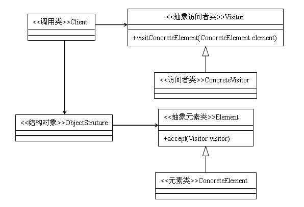

# 访问者模式与ButterKnife

## 访问者模式

### 1. 访问者模式介绍

访问者模式是一种将数据操作与数据结构分离的设计模式。在一个软件系统中拥有一个由许多对象构成，比较稳定的对象结构，这些类都有一个`accept`方法来接收访问者对象的访问。访问者是一个接口，它拥有一个`vist`方法，这个方法会对访问到的对象结构中不同类型的元素做出不同的处理。

### 2. 访问者模式定义

封装一些作用于某种数据结构中的各元素的操作，它可以在不改变这个数据结构的前提下定义作用于这些元素的新的操作。

### 3. 访问者模式使用场景

* 对象结构比较稳定，但经常需要在此对象结构上定义新的操作
* 需要对一个对象结构中的对象进行很多不同步的并且不相关的操作，而需要避免这些操作“污染”这些对象的类，也不希望在增加新操作时修改这些类。

### 4. 访问者模式UML



## ButterKnife

### 1. ButterKnife介绍

ButterKnife是通过注解处理生成样板代码来完成`Android View`的属性和方法的绑定的类库。它简化了以往Android开发中初始化`view`和设置监听的操作。

### 2. Butterknife特性

* 通过使用`@BindView`代替`findViewById`初始化`view`
* 可以同时处理列表或数组中的多个`view`
* 使用类似`@OnClick`的注解替代原有匿名内部类监听方法
* 使用类似`@BindString`的资源注解来替代原有的`getResouces()`查询资源方式

### 3. ButterKnife使用

#### 3.1 配置Android Studio工程

最新版`8.0.1`的ButterKnife引入了`apt-plugin`,在编译期间生成代码，提高了ButterKnife注解的使用效率。

首先打开工程项目的`build.gradle`，引入`apt`编译插件

```groovy
buildscript {
    repositories {
        jcenter()
    }
    dependencies {
        classpath 'com.android.tools.build:gradle:2.1.0'
        classpath 'com.neenbedankt.gradle.plugins:android-apt:1.8'
        // NOTE: Do not place your application dependencies here; they belong
        // in the individual module build.gradle files
    }
}
```

再打开`app`下的`build.gradle`，在`app`下使用`apt`插件，并设置生成索引的包名和类名

```groovy
apply plugin: 'com.neenbedankt.android-apt'

dependencies {
    compile 'com.jakewharton:butterknife:8.0.1'
    apt 'com.jakewharton:butterknife-compiler:8.0.1'
}
```

#### 3.2 View和Resouce

首先需要使用ButterKnife绑定指定的`Activity`，在`onCreate`中调用`ButterKnife.bind(Activity activity)`方法，需要注意的是，调用必须在`setContentView`后执行。初始化View只需要使用`@BindView`注解绑定指定的`View ID`即可。

```java
public class MainActivity extends AppCompatActivity {

    @BindView(R.id.et_name)
    EditText mEtName;

    @BindView(R.id.et_password)
    EditText mEtPasswd;

    @Override
    protected void onCreate(Bundle savedInstanceState) {
        super.onCreate(savedInstanceState);
        setContentView(R.layout.activity_main);
        ButterKnife.bind(this);
    }
}
```
对于资源可以使用：`@BindBool, @BindColor, @BindDimen, @BindDrawable, @BindInt, @BindString`获取。

```java
public class MainActivity extends AppCompatActivity {
    //--
    @BindString(R.string.str_user_name) String strName;
    @BindString(R.string.str_user_passwod) String strPasswd;

    @BindDimen(R.dimen.layout_item_height) int layoutItemHeight;

    @BindColor(R.color.colorPrimary) int mColorPrimary;
    //--
}
```

对于`Fragment`或`ViewHolder`这样的对象同样可以使用ButterKnife。但要使用方法：`bind(@NonNull Object target, @NonNull View source)`。

```java
public class UserInfoFragment extends Fragment{

    @BindView(R.id.iv_photo)
    ImageView mUserPhoto;

    @Nullable
    @Override
    public View onCreateView(LayoutInflater inflater, @Nullable ViewGroup container, @Nullable Bundle savedInstanceState) {
        View bodyView = inflater.inflate(R.layout.fragment_userinfo, container, false);
        ButterKnife.bind(this, bodyView);
        return bodyView;
    }
}
```

ButterKnife还可以同时作用在多个view上，并通过`apply`方法对多个view的数组或列表进行统一的操作。使用`apply`方法需要实现`Action`或`Setter`接口，他们可以实现一些简单的处理。

```java
static final ButterKnife.Action<View> ENABLE = new ButterKnife.Action<View>() {
        @Override
        public void apply(@NonNull View view, int index) {
            view.setEnabled(true);
        }
};

static final ButterKnife.Setter<View, Integer> VISIABLE = new ButterKnife.Setter<View, Integer>() {
        @Override
        public void set(@NonNull View view, Integer value, int index) {
            view.setVisibility(value);
        }
};

    @BindViews({R.id.et_password, R.id.bt_submit, R.id.bt_cancel})
    List<View> mViews;

    @Override
    protected void onCreate(Bundle savedInstanceState) {
        super.onCreate(savedInstanceState);
        setContentView(R.layout.activity_main);
        ButterKnife.bind(this);

        ButterKnife.apply(mViews, ENABLE);

        ButterKnife.apply(mViews, VISIABLE, View.VISIBLE);
    }

    //--
```

`apply`也可以改变View的属性值。

```java
ButterKnife.apply(mViews, View.ALPHA, 0.5f);
```

#### 3.3 设置监听

Butterknife同样简化了设置view的监听功能，通过`@OnClick, @OnTouch, @OnLongClick, @OnCheckedChanged, @OnEditorAction, @OnFocusChange, @OnItemClick, @OnPageChange, @OnTextChanged`可以完成以前需要设置匿名监听类才能完成的工作，而且代码简洁。

NOTE:不同的注解方式有不同的参数和返回值

```java
@OnClick(R.id.bt_submit)
public void onBtSubmit(){
    Log.i(MainActivity.class.getSimpleName(), "onBtSubmit");
}

@OnClick(R.id.bt_cancel)
public void onBtCancel(View view){
    Log.i(MainActivity.class.getSimpleName(), "onBtCancel");
}

@OnTextChanged(value = {R.id.et_name, R.id.et_password}, callback = OnTextChanged.Callback.TEXT_CHANGED)
public void onTextChange(CharSequence text, int start, int before, int count){
    Log.i(MainActivity.class.getSimpleName(), "onTextChange");
}
```

#### 3.4 设置解绑

对于`Fragment`有不同于`Activity`的生命周期，在`onCreateView`方法中初始化，但在`onDestroyView`方法中其`View`会被置`null`，此时需要解绑ButterKnife。

```java
public class UserInfoFragment extends Fragment{

    @BindView(R.id.iv_photo)
    ImageView mUserPhoto;

    private Unbinder mUnbinder;

    @Nullable
    @Override
    public View onCreateView(LayoutInflater inflater, @Nullable ViewGroup container, @Nullable Bundle savedInstanceState) {
        View bodyView = inflater.inflate(R.layout.fragment_userinfo, container, false);
        mUnbinder = ButterKnife.bind(this, bodyView);
        return bodyView;
    }

    @Override
    public void onDestroyView() {
        super.onDestroyView();
        mUnbinder.unbind();
    }
}
```

#### 3.5 安全的绑定

默认情况下，绑定view或者设置监听要求必须可以找到目标view，否则会抛出异常。可以使用`@Nullable`在view的初始化，`@Optional`在设置监听是避免抛出异常。

```java
@Nullable @BindView(R.id.et_name)
EditText mEtName;

@Nullable @BindView(R.id.et_password)
EditText mEtPasswd;

@Optional @OnClick(R.id.bt_submit)
public void onBtSubmit(){
    Log.i(MainActivity.class.getSimpleName(), "onBtSubmit");
}
```

#### 3.6 更简单的初始化View

如果觉得使用`@BindView`注解和`ButterKnife.bind()`方法有些麻烦，可以使用`findById`方法初始化指定`view, Activity, Dialog`中的view。

```java
public class UserInfoFragment extends Fragment{

    private ImageView mPhoto;

    @Nullable
    @Override
    public View onCreateView(LayoutInflater inflater, @Nullable ViewGroup container, @Nullable Bundle savedInstanceState) {
        View bodyView = inflater.inflate(R.layout.fragment_userinfo, container, false);
        mPhoto = ButterKnife.findById(bodyView, R.id.iv_photo);
        return bodyView;
    }

    @Override
    public void onDestroyView() {
        super.onDestroyView();
    }
}
```

#### 3.7 代码混淆

```groovy
#ButterKnife
-keep class butterknife.** { *; }
-dontwarn butterknife.internal.**
-keep class **$$ViewBinder { *; }

-keepclasseswithmembernames class * {
    @butterknife.* <fields>;
}

-keepclasseswithmembernames class * {
    @butterknife.* <methods>;
}
```

# 参考

* [Android源码设计模式解析与实战](http://product.dangdang.com/23802445.html)
* [绝对不容错过，ButterKnife使用详谈](http://www.jianshu.com/p/b6fe647e368b)
* [Butter Knife 源码解析](http://mp.weixin.qq.com/s?__biz=MzA4MjU5NTY0NA==&mid=404147665&idx=1&sn=a16153b2a658db64ab80926cd3b76447&scene=2&srcid=0316ZcLDaO7NOqcReomltlmA&from=timeline&isappinstalled=0#wechat_redirect)
* [公共技术点之 Java 注解 Annotation](http://a.codekk.com/detail/Android/Trinea/%E5%85%AC%E5%85%B1%E6%8A%80%E6%9C%AF%E7%82%B9%E4%B9%8B%20Java%20%E6%B3%A8%E8%A7%A3%20Annotation)
* [Butter Knife](http://jakewharton.github.io/butterknife/)
