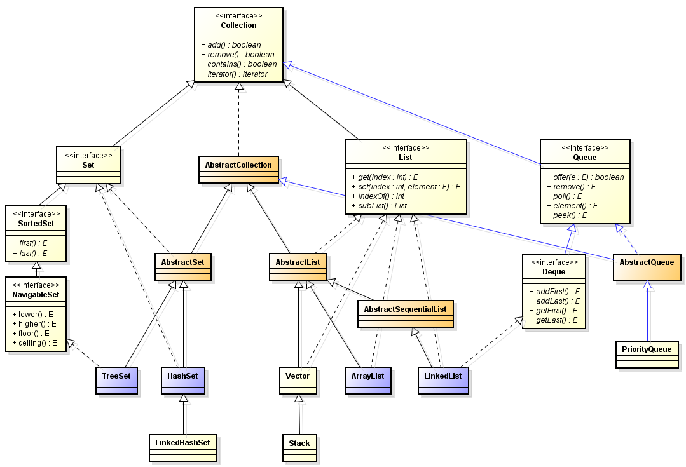
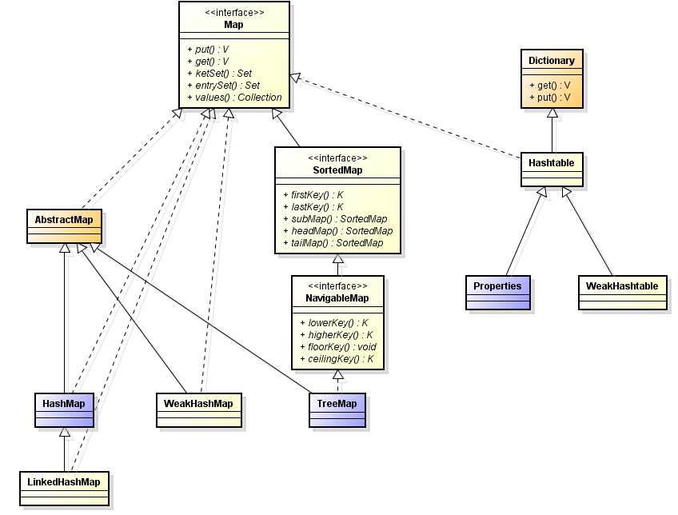

# Java集合

## 集合的框架概述

Java的集合用来实现一些常用的数据结构，如栈、队列、链表和哈希表等，这样极大的提高了开发的效率。Java集合大致可以分为List、Set、Map三种体系，其中Set代表无序的，不可重复的集合；List代表有序的、可重复的集合；Map则代表具有映射关系的集合。从Java1.5以后又增加了Queue体系集合，代表一种队列集合的实现。

Java集合类主要由两个接口：Collection和Map派生而出，这两个接口又包含了一些子接口和实现类。

**Java集合的框架图**


**Collection接口的UML图**



**Map接口的UML图**



> NOTE:以上UML图来自[AlphaWan的博客](http://blog.csdn.net/vking_wang/article/details/16965853)

## Collection和Iterator

Collection接口是List、Set和Queue的父接口，定义了一个高度抽象的集合，它包含了集合的基本操作。
* boolean add(Object)：向集合中添加元素
* boolean addAll(Collection)：把一个集合所有元素添加到指定集合中
* void clear()：清空集合中的元素
* boolean contains(Object)：判断集合中是否包含指定元素
* boolean containsAll(Collection)：判断集合中是否包含指定集合中的所有元素
* boolean isEmpty()：判断集合是否为空
* Iterator iterator()：返回一个Iterator（迭代器）对象，用于集合遍历
* boolean remove(Object)：删除集合中的指定元素，如果存在多个元素，将删除最近出现的。
* boolean remobeAll(Collection)：从集合中删除指定集合中的所有元素
* boolean retainAll(Collection)：从集合中删除指定集合中不包含的元素
* int size()：返回集合中元素的数量
* Object[] toArray()：把集合转换为数组

Iterator用于遍历（即迭代访问）Collection集合中的元素，Iterator也被称为迭代器。Iterator接口隐藏了各种Collection实现类的底层细节，想应用程序提供了遍历Collection集合的同一编程接口。Iteractor接口中主要定义以下三个方法：
* boolean hasNext()：是否还存在为被遍历的元素
* E next(()：返回集合中下一个元素
* void remove()：删除集合中上一次next()方法返回的元素

实现Iterator接口的集合有两种遍历方式：使用接口方法和foreach语法

```java
public class IteratorTest {

	public static void main(String[] args) {
		// TODO Auto-generated method stub
		List list = new ArrayList<>();

		Iterator iterator = list.iterator();
		while(iterator.hasNext()){
			System.out.println(iterator.next());
		}

		for (Object object : list) {
			System.out.println(object);
		}
	}
}
```

> WARNING：当使用Iterator迭代访问集合的时候，集合中的元素不能被改变，只有通过Iterator的remove方法删除上一次next方法返回的集合元素才可以，否则会引发java.util.ConcurrentModificationExpection异常。

## List

## Set

## Map

## Collections和Arrays工具集

# 参考

* [Java容器类](http://alexyyek.github.io/2015/04/06/Collection/)
* [疯狂Java讲义（第二版）](#inner)
* [Java集合类的UML类图](http://blog.csdn.net/vking_wang/article/details/16965853)
