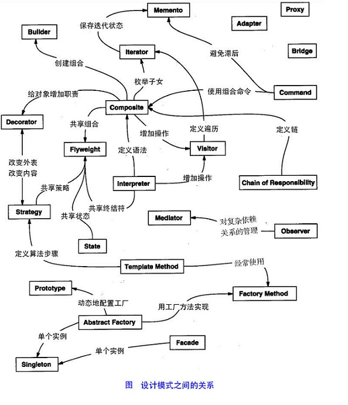
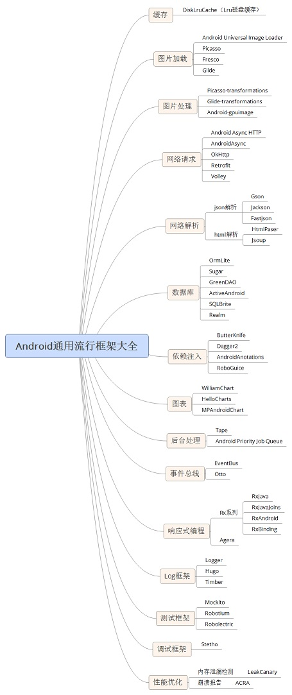

# Android再学习计划

做过两年的Android项目，一直属于半路出家，深感所掌握的知识没有形成体系，所以指定这个“Android再学习计划”，一巩固已经学到的东西，二是让自己的理解更深入一层，形成自己的知识体系。

## 1.对于Android开发的基础

对于这部分，可以说分为两个部分一个是`Java`另一个时`Android`。

Java基本包括以下内容：
* 基础语法
* 集合
* 泛型
* 异常
* IO
* 多线程
* 网络
以上的内容通过学习《疯狂的Java讲义》来学习强化。一些其他资源[深入浅出ClassLoader](http://ifeve.com/classloader)、[Java网络教程](http://ifeve.com/java-network/)、[Java NIO 系列](http://ifeve.com/java-nio-all/)、[Java IO](http://ifeve.com/java-io-3/)、[Java 并发概念汇总](http://www.letiantian.me/2015-05-27-java-concurrency-summary/)、[并发网系列文章](http://ifeve.com/paper-set/)

Android的基本主要包括以下内容：
* UI控件
* 四大组件
* 网络
* 线程
* 动画
* 样式
* MD新特性
以上内容通过学习《Android群英传》、胡凯大神发起的[《Android官方培训课程中文版》](http://hukai.me/android-training-course-in-chinese/index.html)、[《Material Design开发者文档》](http://www.materialdoc.cn/)

## 2. 进阶开发

### 2.1设计模式

刚开始做开发的时候，没觉得设计模式这个事情有多么的重要，但现在做三年的开发过程中走了许多弯路过后，越来发现设计模式的重要性。

设计模式最好要结合实际的应用来学习，这部分学习[《Android源码设计模式解析与实战》](https://github.com/simple-android-framework/android_design_patterns_analysis)

### 2.2 Android流行框架

Android经历这么多年的发展已经产生出来许许多多的开发库，俗话说站在的巨人的肩膀上可以飞的更高（我编的），因此熟悉使用一些第三方的开源库已经成为开发人员的必备技能，具体可以参照以下两篇文章

* [Android流行框架](https://segmentfault.com/a/1190000005073746)

* [AndroidArchitectureCollection](https://github.com/CameloeAnthony/AndroidArchitectureCollection)
 

### 2.3 Android系统Framework

Android系统的核心功能都在其Framework层，有人说一个Android开发人员的分水岭就在于其对Android内核的了解程度。这部分可以看任玉刚的《Android开发艺术探索》

#### 2.3.1 App及Activity的生命周期及启动过程

#### 2.3.2 Handler机制

#### 2.3.3 View的绘画机制

#### 2.3.4 touch事件传递机制 

#### 2.3.5 Binder机制

Binder可以毫不夸张的说是Android系统的最核心之一，整个系统的进程间通信调度几乎都有它的影子，因此了解Android系统的的Binder机制已经成为一名Android开发人员的必备技能。手里关于Android内核的书有两本，但有时候看书也会觉得枯燥，也可以看看别人写的文章加深理解。这里准备四篇文章：

* [Binder学习指南](http://www.jianshu.com/p/af2993526daf)
* [Binder牌胶水](http://www.jianshu.com/p/3d053abba04b)
* [Android Binder设计与实现](http://blog.csdn.net/universus/article/details/6211589)

### 2.4 Java及Android开发技巧

#### 2.4.1 Java性能优化

#### 2.4.2 Android性能优化及技巧

* 胡凯大神的[Android Performance](http://hukai.me/blog/categories/android-performance/)

* [Android客户端性能优化](http://blog.tingyun.com/web/article/detail/155)（魅族资深工程师毫无保留奉献）

* [Android Tips](http://www.wangchenlong.org/categories/Tips/)

* [我和Gradle有个约会](http://bugly.qq.com/bbs/forum.php?mod=viewthread&tid=235&extra=page%3D1)

# 参考资料
<https://segmentfault.com/a/1190000005073746?hmsr=toutiao.io&utm_medium=toutiao.io&utm_source=toutiao.io>

<https://segmentfault.com/a/1190000005059402>

<http://www.cnblogs.com/maowang1991/archive/2013/04/15/3023236.html>

<http://gityuan.com/2016/04/24/how-to-study-android/>

<http://blog.csdn.net/codeemperor/article/details/51004189>