# GitHub 及 Git的基本使用

其实开始接触Github和Git也有三年的时间了，基本的用法还是会的。但在公司的项目中一直用的还是SVN，实际上也只在个人的一些学习项目上用过。所以导致对于Github和Git基本上处于半懂不懂的程度。最近闲暇有些时间，想总结一下两者的使用，也算是一次再学习。

## GitHub建仓过程
这个就不需要介绍了，网上一大堆。注册的过程也略过，直接上手创建仓的过程。


如上图所示创建一个新的仓（Repository），随后将出现下图的界面：


个人觉得在配置仓的时候不要勾选`Initialize this repository with a README`，只是在GitHub创建一个空仓，后续将本地文件推送到GitHub上，这样比较方便。


当在GitHub创建好远程仓库后，就可以在本地创建工程代码，初始化Git版本控制，并与远程的GitHub仓建立联系。

### 1.本地创建工程


#### 1.1  `git init`命令

 `git init`命令用于创建一个Git仓库，不解释

#### 1.2 `git add` 命令

`git add` 命令用于将你创建或修改的文件提交到缓存中，对于新创建的文件，在执行`git add` 命令后则git开始跟踪此文件，以后此文件的任何改动都可以被追踪，以便用户及时把修改过的文件提交到历史记录中。`git add`命令也可以使用目录作为参数，如果参数是目录，该命令将递归作用到目录下的所有文件。`git add`命令是一个多功能的命令：可以用它开始跟踪文件，或者把已经跟踪的文件放到暂存区，还能用于合并时把有冲突的文件标记为已解决状态（后续介绍这个功能）。对于这个命令的正确理解应为：“添加内容到下一次的提交中”。


#### 1.3 `git status`命令

`git status`命令用于查看工程中各个文件的状态，其输出十分详细，包括当前分支名称：master，并告诉你这个分支与远程服务器上的对应分支没有偏离。也指出文件README.md出现了更改，但还未提交到暂缓区。如果存在新创建的文件，则会提示有未跟踪的文件。如果要获取简短的输出结果可以使用参数`-s`或`--short`，下图为简短的输出格式，其中`??`标识新增加的未跟踪的文件，`A`标识新添加到暂缓区中的文件，修改的文件前面有`M`标记，如果有文件被删除则会被`D`标识。关于`M`标识可以出现在两个位置，出现在左边的`M`表示文件被修改了并被放入暂缓区，出现在右边的`M`表示文件被修改了但还没有放入暂缓区。如果此时提交，则在工作区中的修改不会全部（只有放入暂缓区中的修改记录会被提交）提交到历史记录中去。README.md文件在工作区修改并提交大暂缓区后又在工作区被修改，所以工作区和暂缓区都有该文件的修改记录。对于一些不愿意纳入Git管理的文件，可以在`.gitignore`文件中配置，关于`.gitignore`文件后面介绍。


#### 1.4 `git commit`

`git commit`命令用于提交更新。当你用`git status`查看所有的改动都已经缓存起来时，就可以使用`gti commit`命令把改动保存到历史记录中去。默认使用`git commit`命令会启动系统文本编辑器以便输入本次提交的说明，不建议这样使用。可以在`git commit`后添加`-m`选项，将提交的信息与命令放在一起。对于每次提交前都需要使用`git add`命令，很多人会觉得繁琐，则可以在`git commit`后面加上`-a`选项，Git会把所有已经跟踪的文件暂存起来一起提交，从而跳过`git add`的步骤。

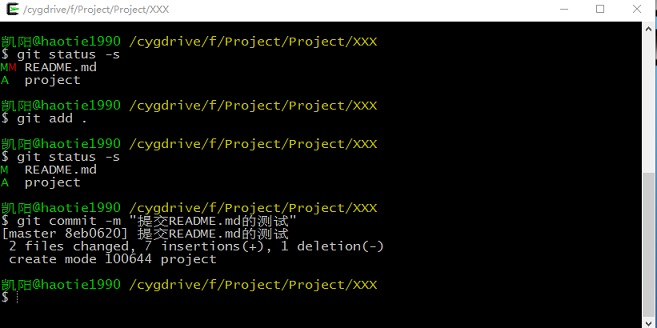

### 2.为本地仓库添加到远程仓库

当我们在GitHub创建好一个空的仓库后，GitHub告诉我们，可以从这个仓库克隆出新的仓库，也可以把一个已经有的本地仓库与之关联，然后把本地仓库的内容推送到GitHub仓库。


#### 2.1 将本地Git仓库与GitHub仓库关联，此处使用HTTPS协议的仓库地址，也可以使用SSH协议的仓库地址。


> 这里使用了HTTPS协议来推送，这样Git服务器每次都会询问用户名和密码，如果不想每次推送都输入用户名和密码，可以设置一个`credential cache`来保存用户名和密码几分钟。也可以使用`store`模式永久的保存用户名和密码，`git config --global credential.helper cache`

## Git的日常使用

### 1. 版本控制

#### 1.1 撤销对文件的修改

如果修改了文件，但是发现修改出现问题，想撤销所有对文件的修改，还原成上次提交时候的样子，如果你仔细看了`git status`命令的信息，你会发现你该如何做。

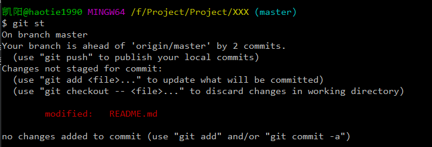

按照提示：`git checkout -- README.md`

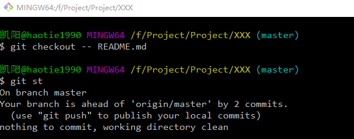

但你需要知道一点`git checkout -- <file>...`命令是个危险的命令，因为这个命令实际上时拷贝另一个文件来覆盖修改的文件，一旦执行你所有的修改都将消失无法恢复。如果你仍然想保留对这个文件的修改，但是现实需要撤销，那么在[分支管理]()中将会介绍更好的方法。

记住，在`Git`中任何__**已提交**__的东西几乎总是可以恢复的，然而，任何你未提交的东西丢失后很难再找回来。

#### 1.2 取消暂存的文件

有时候你同时修改了两个文件，但是你希望将它们作为两次独立的提交。但你却意外的使用了`git add .`命令，导致暂缓了两个文件，此时需要把其中一个文件从暂缓区撤销。其实`git status`同样告诉了我们怎么做。

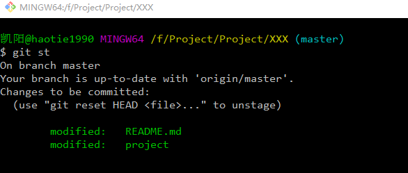

按照提示：`git reset HEAD project`

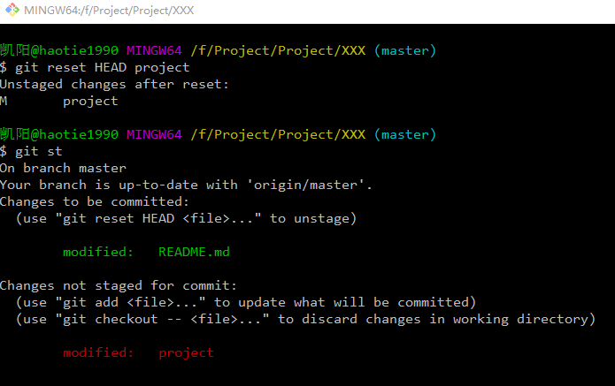

此时执行`git commit`将会只提交`README.md`文件

#### 1.3 回退版本

`Git`作为版本控制工具，很重要的功能就是在需要的时候可以回退版本。版本控制最重要的命令即是`git reset` 。`git reset`命令可用于将当前分支HEAD重置到指定的提交版本状态。

```
git reset [--soft | --mixed [-N] | --hard | --merge | --keep] [-q] [<commit>]
```
`--soft`：只修改HEAD指向，但是不会改变暂缓区和工作区的文件状态

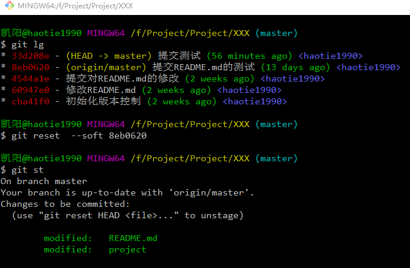

`--mixed`：修改HEAD指向，并用指定提交覆盖暂缓区，但不改变工作区状态。其作为默认选项

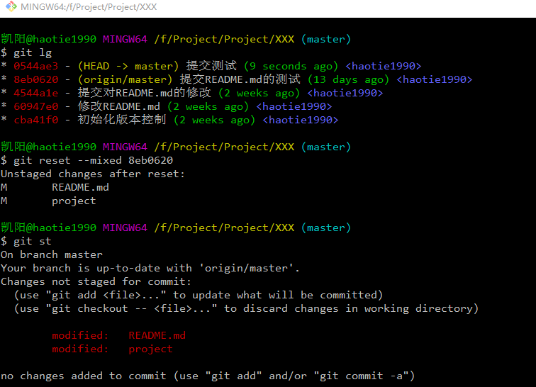

`--hard`：此命令很危险，因为它将修改HEAD指向，覆盖暂缓区，同时工作区的所有修改删除，还原到指定提交状态。

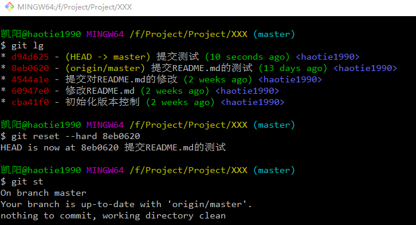

NOTE：做版本回退更多的时候是验证过去的代码问题，此时最好另开分支再做`reset`

#### 1.4 删除文件

通常情况下删除文件使用`rm`命令即可。但此时`git status`会告知有文件被删除，如果确认要将此文件删除，可以使用`git rm`命令将此文件从版本库中删除，然后`git commit`。但如果是误删除，可以使用`git checkout`命令回复被误删的文件。

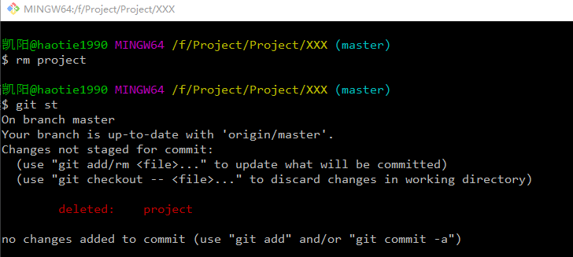

### 2. 分支管理

**分支**是所有的版本控制系统的必备，像`SVN`这样的版本控制系统，如果要建立分支，需要完全创建一个源代码目录的副本，如果是一个巨大的项目，那么将耗费很多时间。但在`Git`上创建分支非常迅速，瞬间完成。

#### 2.1 创建分支

如果需要创建分支，那么使用`git branch`命令，如下即创建一个`dev`分支，但当前仍然在原有分支上，并没有切换到新创建的`dev`分支上。

```
git branch dev
```

若要在GitHub版本库上创建分支，首先要在本地版本库中创建新的分支，然后用推送命令将本地新创建的分支及其包含的提交推送到GitHub版本库中完成GitHub上的分支创建。

以下命令用于将一个本地分支及其提交推送到远程版本库

```
git push origin branch_name:branch_name
```

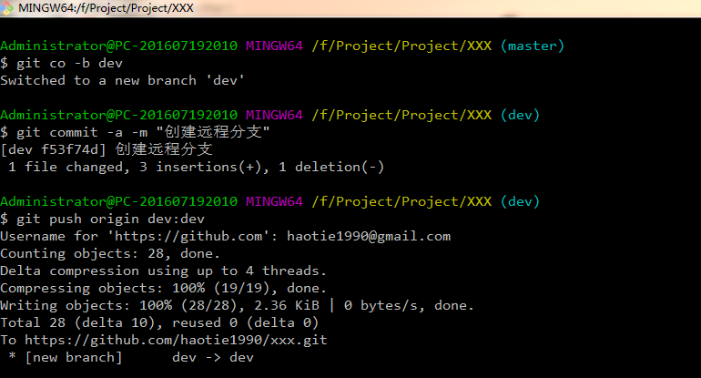

#### 2.2 分支切换

如果需要切换到某个分支上去，需要使用`git checkout`命令，如下即切换到`dev`分支上。

```
git checkout dev
```

`git checkout`实际上做了两件事，一是将HEAD指向新的分支，二是把工作区恢复到新分支最后一次提交时的状态。因此切换分支时，工作区的文件会被**改变**。同时也可以使用`git checkout -b`命令来快速完成一个新分支的创建与切换。

#### 2.3 合并分支

在实际的工作中，经常遇到的情况是：

* 开发某个项目
* 为实现新的功能需求，创建一个新的`dev`分支，并开展工作
* 分配到一个紧急问题需要解决,切换回`master`分支，创建一个`bug`分支，并在其中修复问题
* 修复紧急问题，回到`master`分支，合并`bug`分支，提交改动
* 切换回`dev`分支继续开发工作

首先当你想从`dev`分支切换到`master`分支时，需要保证`dev`分支此时的状态是干净的，否则就会如下图，无法切换到`master`分支。但此时你又不想因为只是修改一个bug而为做一半的工作创建一次提交，针对这个问题可以使用`git stash`命令。

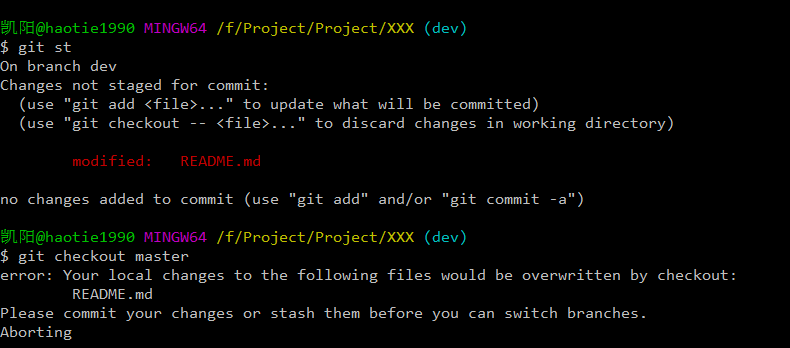

完成的命令格式：
```
git stash [save [-p|--patch] [-k|--[no-]keep-index] [-q|--quiet]       [-u|--include-untracked] [-a|--all] [<message>]]
```
默认使用`git stash`即可保存工作进度，但如果要为保存的工作进度添加描述，则需要使用`git stash save <message>`命令。其他部分参数使用如下：

* `-k|--keep-index`：同时保存暂缓区的状态
* `-u|--include-untracked`：同时保存为被跟踪的文件

保存好工作进度后，可以使用`git stash list`查看存储栈的情况。需要恢复的时候，使用` git stash pop|apply <stash>`来恢复工作区到指定保存进度。其中`pop`和`apply`的区别是，`pop`会删除已恢复的工作进度，而`apply`不会。加入`--index`会同时恢复暂存区。

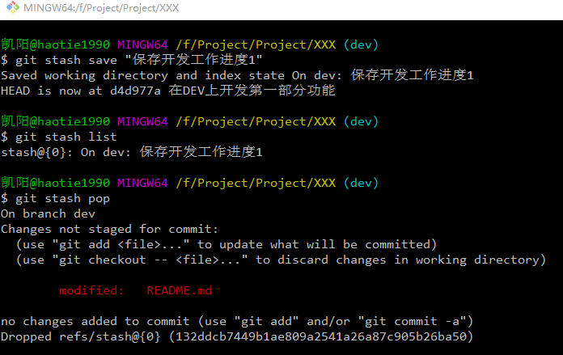

在完成`dev`分支切换和`bug`分支创建后，进入`bug`分支修复问题，当完成问题修改后，需要回到`master`分支，将`bug`分支的修改合并到`master`分支中。此时需要使用`git merge`命令。`git merge`命令用于合并指定分支到当前分支，默认情况下，合并分支采用`Fast-forward`的模式，即直接把`master`分支指向`bug`分支，在这种模式下，删除分支后，会丢掉分支信息。如果需要禁用`Fast-forward`可以使用`--no-ff`,此时将创建一个提交，那么加上`-m`把提交描述补上。

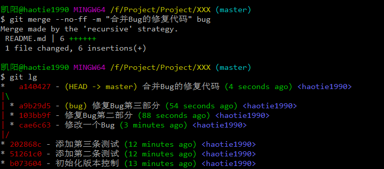

### 2.4 删除分支

当你在一个分支完成开发工作并将其合并到其他分支，例如在bug分支修复完问题后，并将修改的内容合并到beta分支，那么此时bug分支的任务应经完成，可以删除此分支。删除分支可以在命令`git branch`后面加参数`-d`或者`-D`，由于git在删除分支时候，为了避免数据丢失，默认禁止删除尚未合并的分支，参数`-D`则可以强制删除尚未合并的分支。

删除本地分支后，有时候还会存在远程分支，要删除远程分支则需要使用`git push`命令，并在远程分支的名称前面加上`:`。

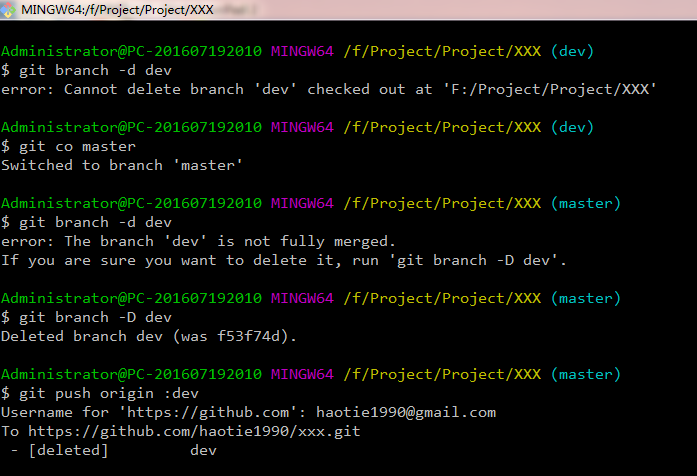

### 3. 标签管理

### 4. 自定义Git

# 参考
* <http://www.liaoxuefeng.com/wiki/0013739516305929606dd18361248578c67b8067c8c017b000>
* <http://www.worldhello.net/gotgithub/index.html>
* <https://git-scm.com/book/zh/v2>
