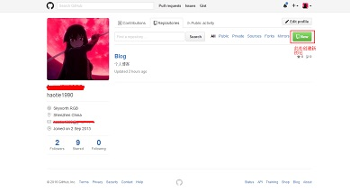
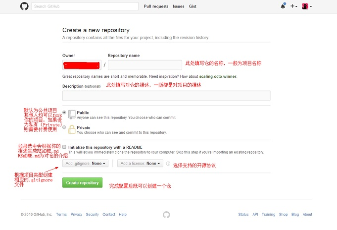
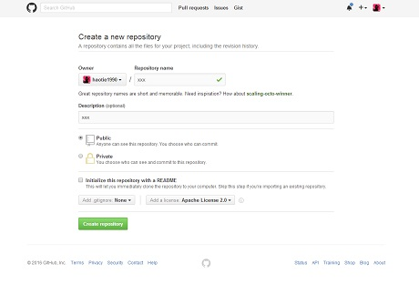
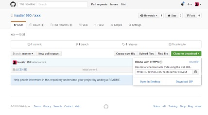
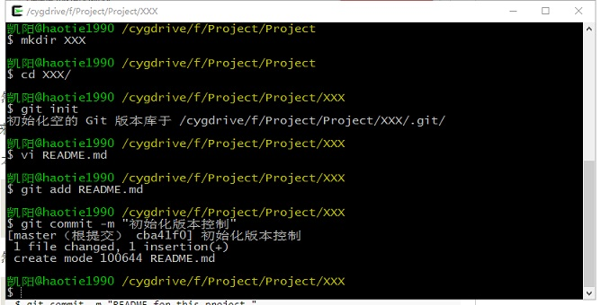
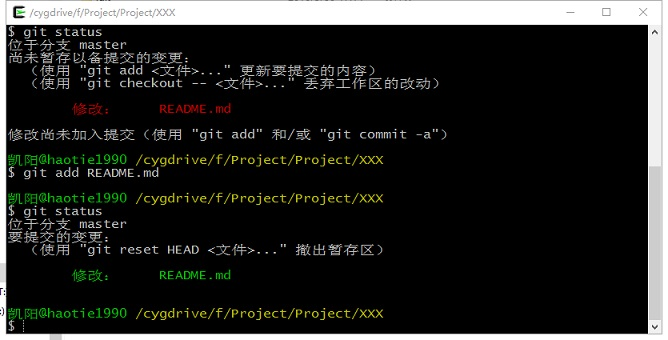
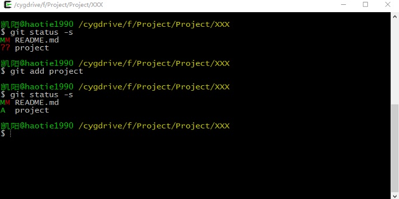
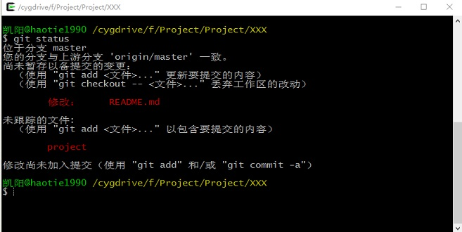
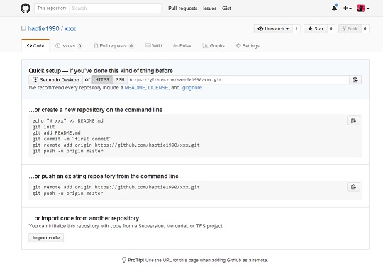
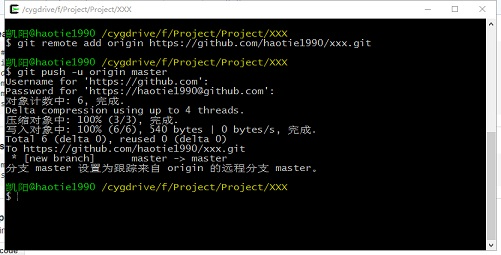

# GitHub 及 Git的基本使用

其实开始接触Github和Git也有三年的时间了，基本的用法还是会的。但在公司的项目中一直用的还是SVN，实际上也只在个人的一些学习项目上用过。所以导致对于Github和Git基本上处于半懂不懂的程度。最近闲暇有些时间，想总结一下两者的使用，也算是一次再学习。

## GitHub建仓过程
这个就不需要介绍了，网上一大堆。注册的过程也略过，直接上手创建仓的过程。

如上图所示创建一个新的仓（Repository），随后将出现下图的界面：

个人觉得在配置仓的时候不要勾选`Initialize this repository with a README`，只是在GitHub创建一个空仓，后续将本地文件推送到GitHub上，这样比较方便。

当在GitHub创建好远程仓库后，就可以在本地创建工程代码，初始化Git版本控制，并与远程的GitHub仓建立联系。

#### 1.本地创建工程及版本控制

##### 1.1  `git init`：创建一个Git仓库，不解释
##### 1.2 创建README.md文件来描述此工程
##### 1.3 `git add` 命令用于将你创建或修改的文件提交到缓存中，对于新创建的文件，在执行`git add` 命令后则git开始跟踪此文件，以后此文件的任何改动都可以被追踪，以便用户及时把修改过的文件提交到历史记录中。`git add`命令也可以使用目录作为参数，如果参数是目录，该命令将递归作用到目录下的所有文件。`git add`命令是一个多功能的命令：可以用它开始跟踪文件，或者把已经跟踪的文件放到暂存区，还能用于合并时把有冲突的文件标记为已解决状态（后续介绍这个功能）。对于这个命令的正确理解应为：“添加内容到下一次的提交中”。

##### 1.4 `git status`命令用于查看工程中各个文件的状态，其输出十分详细，包括当前分支名称：master，并告诉你这个分支与远程服务器上的对应分支没有偏离。也指出文件README.md出现了更改，但还未提交到暂缓区。如果存在新创建的文件，则会提示有未跟踪的文件。如果要获取简短的输出结果可以使用参数`-s`或`--short`，下图为简短的输出格式，其中`??`标识新增加的未跟踪的文件，`A`标识新添加到暂缓区中的文件，修改的文件前面有`M`标记，如果有文件被删除则会被`D`标识。关于`M`标识可以出现在两个位置，出现在左边的`M`表示文件被修改了并被放入暂缓区，出现在右边的`M`表示文件被修改了但还没有放入暂缓区。如果此时提交，则在工作区中的修改不会全部（只有放入暂缓区中的修改记录会被提交）提交到历史记录中去。README.md文件在工作区修改并提交大暂缓区后又在工作区被修改，所以工作区和暂缓区都有该文件的修改记录。对于一些不愿意纳入Git管理的文件，可以在`.gitignore`文件中配置，关于`.gitignore`文件后面介绍。

##### 1.5 `git commit`

#### 2.为本地仓库添加到远程仓库

当我们在GitHub创建好一个空的仓库后，GitHub告诉我们，可以从这个仓库克隆出新的仓库，也可以把一个已经有的本地仓库与之关联，然后把本地仓库的内容推送到GitHub仓库。

##### 2.1 将本地Git仓库与GitHub仓库关联，此处使用HTTPS协议的仓库地址，也可以使用SSH协议的仓库地址，但使用SSH协议的地址需要SSH Key（后面介绍）。

# 参考
* <http://www.liaoxuefeng.com/wiki/0013739516305929606dd18361248578c67b8067c8c017b000>
* <http://www.worldhello.net/gotgithub/index.html>
* <https://git-scm.com/book/zh/v2>

